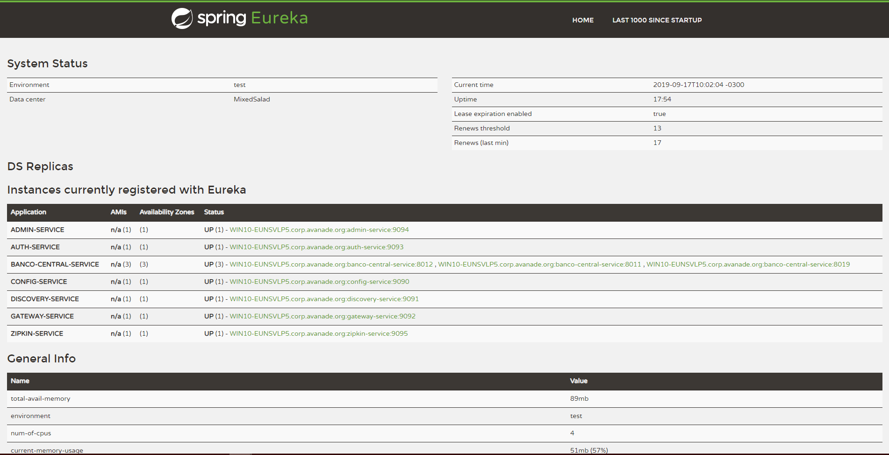

# MixedSaladService
 Mixed Salad Project para desenvolvimento e estudo de tecnologias Java com Spring Boot.
 
 ### Detalhes do Projeto (Escopo)
  
  Produzir um software que suporte transações entre serviços usando as seguintes 
  tecnologias:
 
  * Service Discovery
  * Register Service
  * Zipkin Service DashBoard
  * Circuit Breaker²
  * Metrics Dashboard (Admin Server)
  * Load balance
  * SSO¹
  * Elasticsearch¹
  * Docker 
  * Kubernetes¹
  * CI - Integração Continua 
  * Client Mobile (Android, IOS)¹
  * Client Web¹
  * Client Desktop¹
    
    ¹ = Em estudo para implementação;
    ² = Como aplicar na estrutura atual?
  
  Haverá dois bancos ficticios usando diferentes tecnologias para comunicação 
  como Rest/SOAP e um banco central, que será o centro de todas transações entre 
  os bancos ficticios.
  
  Cada banco terá que ser totalmente auto suficiente e ele deve estar preparado 
  para ser tolerante a falhas, responsivo e resiliente, O projeto deverá cumprir
  a meta de 90% de cobertura no codigo.
 
 #### Características gerais do Projeto:  
 * Projetos criado com Spring Boot e Java 8 -> { https://spring.io/ }
 * Banco de dados H2 com JPA e Spring Data JPA 
 * Migração de banco de dados com Flyway -> { https://flywaydb.org/ }
 * Testes unitários e de integração com JUnit e Mockito -> { http://jmockit.github.io/ }
 * Integração contínua com TravisCI -> { https://travis-ci.org }

 ### Images
 
 ##### DashBoard Admin-Service (http://localhost:9094/admin)
 
 
 ##### DashBoard Zipkin-Service (http://localhost:9095/zipkin/)
 
 
 ##### DashBoard eureka-Service (http://localhost:9091)
  
    